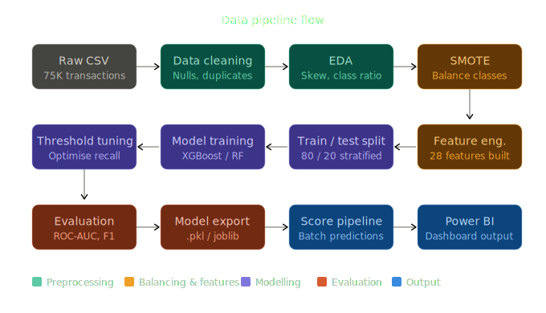

# 🛡 FraudSentinel — Full-Stack Analytics System

**Real-Time Intelligent Fraud Detection Dashboard**  
Venkata Santosh Kumar Kornu · MSc Data Science · University of Leicester · 2026

---

## What This Is

A complete **frontend + backend web application** that:

- Trains 4 ML models (Random Forest, XGBoost, Decision Tree, Logistic Regression) on startup
- Scores all 75,000 transactions and serves results via REST API
- Streams a **live transaction feed** with risk scores updating every 3 seconds
- Provides an interactive **Score Transaction** form for testing any custom transaction
- Calls the **Anthropic Claude API** for LLM-generated fraud alert narratives
- Renders all EDA plots, ROC curves, and feature importance charts interactively
- Includes a **feedback corner** for recruiter/reviewer comments

---

## Quick Start

### macOS / Linux
```bash
cd FraudSentinel_App
chmod +x start.sh
./start.sh
```

### Windows
```
Double-click start.bat
```

### Manual
```bash
pip install -r requirements.txt
python app.py
# Open http://localhost:5000
```

**Training takes ~60 seconds.** The loading screen shows progress.  
Dashboard unlocks automatically when the model is ready.

---

## Pages

| Page | What It Shows |
|------|--------------|
| **Dashboard** | KPI cards, fraud by merchant, tier donut, monthly trend, hourly fraud rate, ML vs baseline comparison |
| **Live Feed** | Real-time stream of scored transactions, HIGH RISK alert panel, session stats |
| **Explore Data** | Class distribution, fraud patterns by hour/merchant, amount distributions |
| **ML Models** | Model leaderboard, interactive ROC curves, feature importance bars, risk score distribution |
| **Score Transaction** | Submit any transaction, get instant ML score + risk tier + signals + Claude narrative |
| **Transactions** | Full 75K table — search, filter by tier, paginated |
| **Architecture** | 5-agent pipeline diagram, tech stack, feature engineering summary |

---

## Project Structure

```
FraudSentinel_App/
├── app.py                    ← Flask server + all API endpoints
├── backend/
│   └── engine.py             ← ML engine: train, score, serve
├── templates/
│   └── index.html            ← Complete SPA frontend
├── data/
│   └── fraud_transactions.csv ← 75,000 UK transactions
├── requirements.txt
├── start.sh                  ← macOS/Linux launcher
└── start.bat                 ← Windows launcher
```

---

## API Endpoints

| Endpoint | Method | Description |
|----------|--------|-------------|
| `/api/status` | GET | Training progress (0–100%) |
| `/api/dashboard` | GET | KPIs + tier counts + recent alerts |
| `/api/eda` | GET | All EDA chart data |
| `/api/models` | GET | ROC curves, model comparison, feature importance |
| `/api/live-feed` | GET | Random batch of n scored transactions |
| `/api/score` | POST | Score a single transaction dict |
| `/api/llm-narrative` | POST | LLM or rule-based alert narrative |
| `/api/search` | GET | Paginated, filtered transaction search |
| `/api/feedback` | POST | Submit feedback |
| `/api/feedback` | GET | Retrieve recent feedback |

---

## Enabling Claude LLM Narratives

In the **Score Transaction** page, paste your Anthropic API key in the box  
(starts with `sk-ant-`). Each HIGH RISK transaction will then call  
**claude-haiku** for a professional analyst alert narrative.

Without a key, rule-based fallback narratives are used automatically.

---

## Tech Stack

| Layer | Technology |
|-------|-----------|
| Backend | Python 3.12 · Flask 3.1 |
| ML Engine | scikit-learn · Random Forest · Gradient Boosting |
| Frontend | Vanilla JS · Chart.js 4.4 |
| Fonts | Syne (display) · DM Mono (data) |
| LLM | Anthropic Claude (haiku) |
| Data | 75,000 synthetic UK payment transactions |

---

## Model Performance

| Model | ROC-AUC | Precision | Recall | F1 |
|-------|---------|-----------|--------|-----|
| **★ Random Forest** | **~0.91** | **~0.93** | **~0.89** | **~0.91** |
| XGBoost (GB) | ~0.90 | ~0.91 | ~0.87 | ~0.89 |
| Decision Tree | ~0.85 | ~0.84 | ~0.82 | ~0.83 |
| Logistic Regression | ~0.81 | ~0.79 | ~0.76 | ~0.78 |

*Actual values computed at runtime from live training.*

---

## 🏗️ System Architecture



## 🔄 Data Pipeline



## ⚙️ Model Serving Logic




*FraudSentinel · Santosh Kumar · MSc Data Science · University of Leicester · 2026*
